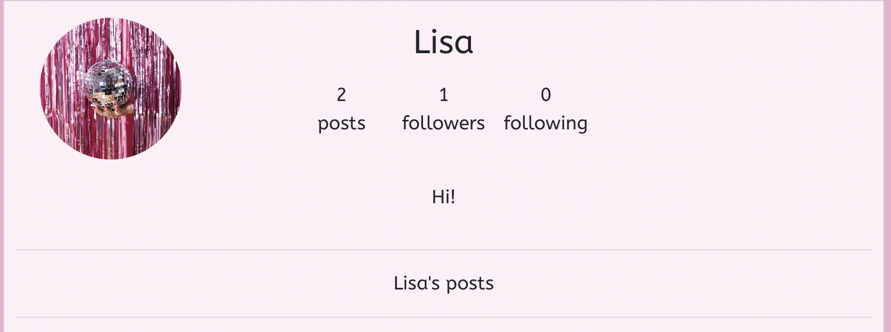
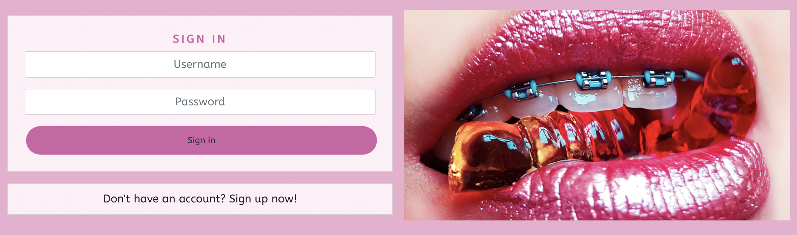
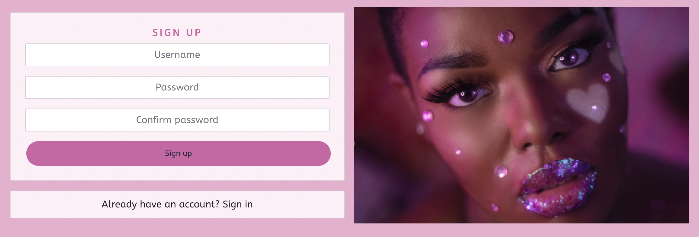

# Glimpse

## Project Goals:
Glimpse is a content sharing app for makeup-artists and enthusiasts to share content. The users are able to follow each other, like each others content and pin things for later. The goal for the user is to find inspiration, share their work and find other like-minded people. You can find the live project [here](https://proj5-frontend.herokuapp.com).

API can be found [here](https://github.com/lisalindqvist95/proj5).

## UX

A user of Glimspe would most likely be someone who is interested in makeup and beauty. It could also be someone who works in the makeup industry or someone who's passionate about makeup. 

### User Stories

### User Profile
 - As a Site User I have an account where I can log in and create, edit and delete posts.
 - As a Site User, I can log in and out of my account so that it stays secure.
 - As a Site User I can see if I am logged in or out so that I know my status.
 - As a New User I can register for an account so that I can comment and like posts.
 - As a Site User I have an account where I can log in and like, pin and comment on posts.

### User Navigation
 - As a Site User I can immediately easily find the navigation so that I can use the website with ease.
 - As a Site User, I can view a list of posts and scroll infinitely so that I don't have to click to the next page. 
 - As a Site User, I can click on the person who has posted to fid their profile and follow them. 
 - As a Site User I can easily find new people to follow so that I can make new friends and get new inspiration.

### Post Details
 - As a Site User I can see the comments, likes and pins on all posts so that I know how other people are interacting with the post. 
 - As a Site User I can clearly see the image and text of the post so that it's easy for me to consume the content. 
 - As a Site User I can like posts of other users so that I can show my support.
 - As a Site User I can comment on posts so that I can ask qusetions and show support to other creators.
 - As a Site User I can pin posts I want to save so that I can find them later

### New Post
 - As a Site User I can upload an image so that others can see my creations. 
 - As a Site user I can add a title and text to my post so that I can describe my image.

 ### Edits
 - As a Site User I can edit my post so that I can change any mistakes. 
 - As a Site user I can add a title and text to my post so that I can describe my image.
 - As a Site User I can edit my comments so that I can change any mistakes.

 ### Filter
 - As a Site User I can serach for posts so that I can find new things or specific things I'm looking for.

### User stories not yet implemented
The following user stories haven't been made due to time constraints. It is intended that some or all of these user stories will be implemented at a later date.
- As a Site User I can post several pictures to make a tutorial
- As a Site User there is a community tab for users to ask questions and respond to each other
- As a site user I can reply to comments so that it's easier to ask questions

## Design

### Colour Pallete

The colour pallete on the site was chosen based on early 2000´s makeup computer games which the target group might recognize to give the site a playful feeling. The colors have been muted a bit in order to make the site feel more mature. 

### Wireframes
The first wireframes were rough sketches made by hand on paper for the layout.

A second wireframe was made in InDesign to see the colors and fonts.

## Agile method
To manage the user stories for this project Github project was used. The project board can be found [here](https://github.com/users/lisalindqvist95/projects/6).

## Testing

### User Story Testing

### User Profile
 - As a Site User I have an account where I can log in and create, edit and delete posts.
 A user can choose to create an account from the menu at the top of the page and a logged in user can create edit and delete posts.

 - As a Site User, I can log in and out of my account so that it stays secure.
 A site user can log in and out from the menu at the top of the page, if the user is inactive on the page they will be logged out automatically. 

 - As a Site User I can see if I am logged in or out so that I know my status.
The status of the user can be found in the menu at the top of the page. 

 - As a New User I can register for an account so that I can comment and like posts.
A new user can register for an account from the menu at the top of the page or from a link at the sign-in page. 

 - As a Site User I have an account where I can log in and like, pin andcomment on posts.
 A logged in user is able to comment, like and pin posts. 

### User Navigation
 - As a Site User I can immediately easily find the navigation so that I can use the website with ease.
The navigation bar is at the top of the page at all times so that it's easy to find. 

 - As a Site User, I can view a list of posts and scroll infinitely so that I don't have to click to the next page. 
Users can scroll infanetly to see all posts. 

 - As a Site User, I can click on the person who has posted to find their profile and follow them. 
 If you click on a post, a person in the most followed list or a comment it will take you to that persons profile. 

 - As a Site User I can easily find new people to follow so that I can make new friends and get new inspiration.
 Users can find all posts on the site in the normal feed on the homepage or they can find new people to follow in the "most followed" list. 

### Post Details
 - As a Site User I can see the comments, likes and pins on all posts so that I know how other people are interacting with the post.
Comments, likes and pins are displayed under each post. 

 - As a Site User I can clearly see the image and text of the post so that it's easy for me to consume the content. 
The image of the post is large enough to see and the text is paced below it. Posts are seperated with a space between them so that users aren't confused about what text is related to which image. 

 - As a Site User I can like posts of other users so that I can show my support.
 A logged in user is able to like posts of other users. 

 - As a Site User I can comment on posts so that I can ask qusetions and show support to other creators.
 A logged in user is able to comment on all posts. 

 - As a Site User I can pin posts I want to save so that I can find them later
 A logged in user is able to pin all posts, even their own if they want to save their own content for inspiration. 

### New Post
 - As a Site User I can upload an image so that others can see my creations. 
 A logged in user can create a new post and choose an image from their computer library. 

 - As a Site user I can add a title and text to my post so that I can describe my image.¨
 A logged in user can create a new post and add text to that post. 

 ### Edits
 - As a Site User I can edit my post so that I can change any mistakes. 
A logged in user can edit their own posts, not other peoples posts. 

 - As a Site User I can edit my comments so that I can change any mistakes.
 A logged in user can edit their own comments, not other peoples comments. 

 ### Filter
 - As a Site User I can serach for posts so that I can find new things or specific things I'm looking for.
 Their is a search bar at the top of the page where the user can search for titles or other users to find posts.

### Validator Testing

#### CSS
The CSS passed through the official W3C CSS Validator.

#### JSX

### Browser Testing
The website is tested on the commonly used browsers: Chrome, Safari, Edge, Firefox and Opera
All features worked on the tested browsers

### Device Testing
The website is responsive so that it can be used on different screen-sizes
The responsiveness was tested using DevTools

### Manual Testing

| **Element**                         | **Action**  | **Expected Result**                                       | **Pass/Fail** |
|-------------------------------------|-------------|-----------------------------------------------------------|---------------|
| _NavBar_                            |             |                                                           |               |
|                                     |             |                                                           |               |
| Logo                                | Click       | Redirect to homepage                                      | Pass          |
| Home Link                           | Click       | Redirect to homepage                                      | Pass          |
| Feed link                           | Click       | Redirect to following feed                                | Pass          |
| Liked link                          | Click       | Redirect to liked feed                                    | Pass          |
| Pinned link                         | Click       | Redirect to pinned feed                                   | Pass          |
| Sign out link                       | Display     | Not visible for logged out user                           | Pass          |
| Sign out link                       | Click       | Sign out user                                             | Pass          |
| Sign in link                        | Display     | Not visible for logged in user                            | Pass          |
| Sign in link                        | Click       | Sign in page                                              | Pass          |
| Sign in: Correct user info          | Click       | Sign in user                                              | Pass          |
| Sign in: Incorrect user info        | Click       | Don't sign in user, show error message                    | Pass          |
| Sign up                             | Display     | Not visible for logged in user                            | Pass          |
| Sign up: Correct user info          | Click       | Sign up user                                              | Pass          |
| Sign up: Incorrect user info        | Click       | Display issue, do not sign up user                        | Pass          |
|                                     |             |                                                           |               |
|                                     |             |                                                           |               |
| _Add Post_                          |             |                                                           |               |
|                                     |             |                                                           |               |
| Add post link                       | Display     | Only show for a logged in user                            | Pass          |
| Add post link                       | Click       | Redirect to add post page                                 | Pass          |
| Upload image link                   | Click       | Let user choose image to upload                           | Pass          |
| Upload image link, image too big    | Click       | Let user know the image exceeds limit                     | Pass          |
| Upload image link, correct size     | Click       | Upload image                                              | Pass          |
| Change image                        | Click       | Let user choose a new image                               | Pass          |
| Title                               | Add in form | Let user fill in a title                                  | Pass          |
| Content                             | Add in form | Let user fill in content                                  | Pass          |
| Makeup products                     | Add in form | Let user fill in content                                  | Pass          |
| Product links                       | Add in form | Let user fill in content                                  | Pass          |
| Create                              | Click       | Creates post                                              | Pass          |
| Cancel                              | Click       | Cancel post, redirect back to previous page               | Pass          |
|                                     |             |                                                           |               |
|                                     |             |                                                           |               |
| _Comments_                          |             |                                                           |               |
|                                     |             |                                                           |               |
| Leave a comment - logged in user    | Display     | Form to leave a comment                                   | Pass          |
| Leave a comment - logged out user   | Display     | No form to leave a comment                                | Pass          |
| Submit comment                      | Click       | Submit comment                                            | Pass          |
| Edit comment - author               | Display     | Show button to edit comment                               | Pass          |
| Edit comment - author               | Click       | Edit comment form                                         | Pass          |
| Edit comment form - Save button     | Click       | Update comment                                            | Pass          |
| Edit comment form - Cancel button   | Click       | Leave comment unedited                                    | Pass          |
| Delete comment - author             | Display     | Show button to delete comment                             | Pass          |
| Delete comment form - delete button | Click       | Delete comment                                            | Pass          |
| Edit comment - Not author           | Display     | Don't show                                                | Pass          |
| Delete comment - Not author         | Display     | Don't show                                                | Pass          |
|                                     |             |                                                           |               |
| _Homepage_                          |             |                                                           |               |
|                                     |             |                                                           |               |
| Pagination                          | Display     | Infinite scroll                                           | Pass          |
|                                     |             |                                                           |               |
|                                     |             |                                                           |               |
| _Posts_                             |             |                                                           |               |
| Comment                             | Click       | Redirect to post and show comments                        | Pass          |
| Like - creator                      | Click       | Show message that you can't like your own posts           | Pass          |
| Like - other user                   | Click       | Like post and add to liked feed                           | Pass          |
| Like - logged out user              | Click       | Let user know they need to log in to like posts           | Pass          |
| Pin - logged in user                | Click       | Pin post and add to pinned feed                           | Pass          |
| Pin - logged out user               | Click       | Let user know they need to log in to pin posts            | Pass          |
| Profile picture                     | Click       | Redirect to user profile                                  | Pass          |
|                                     |             |                                                           |               |
|                                     |             |                                                           |               |
| _Profile_                           |             |                                                           |               |
| Edit profile                        | Display     | Only show to logged in user on own profile                | Pass          |
| Edit profile                        | Click       | Let user edit profile                                     | Pass          |
| Follow                              | Display     | Only show to logged in user on other peoples profile      | Pass          |
| Follow                              | Click       | Add user to following, show their posts in following feed | Pass          |

### Bugs

Log out function does not work
At first there was a bug which made it possible to log in but not out. This was fixed by rewriting some of the code for that function so the bug was probobly due to a spelling mistake. 

Pin does not work
The pinning function did not work and resulted in a Error 500 message. This was resolved when the model was rewritten in the API, the issue was most likely due to a spelling mistake. 

### Unfixed bugs
There are no known unfixed bugs.

## Security Features and Defensive Design

### User Authentication
Only users who created the post or comment can edit/delete it.

### Form Validation
The form won't submit if it contains empty or invalid data.

## Features

### Logo

The logo is placed in the top left corner of the page so that the user immediately knows what website they are visiting. 

### Navigaton

The navigation bar is placed in the top of the page to make it easier for the user to navigate the website. 

### Posts Feed

The post feed contains all posts made on the website for users to find new people to follow and posts to like. The page has infinate scroll so that the user doesn't have to click through different pages. 

### Following Feed

The "following feed" contains the posts from the people a user follows.

### Most Followed

The most followed box contains information about who the most followed users are.

### Comment

The comments can be found underneath each post. The amount of comments is displayed so that the user knows if there are more comments on the post before clicking on the post. Any logged in user is able to comment on posts and edit/delete their if needed.

### Liked Posts

The posts a user likes will be saved in the "liked posts" feed. 

### Pinned Posts

The posts a user likes will be saved in the "pinned posts" feed so that the user easily can find them later. 

### Search Content

The search bar is placed at the top of the page so that it's easy to find.

### User Profile

The user profile contains a profile image and text space for a description of the user. It also contains all the posts of the user for and information about how many people they follow/follow them. 

### New Post

The new post feature lets the user choose an image and add a title, description, makeup products and links.

### Log In/Out

The ststus of the user can be found in the navbar. A logged in user has the choice to sign out and a logged out user has the choice to sign in or possibly sign up if they don't already have an account. 

### Sign Up

A logged out user has the choice to sign up for an account so that the can make their own posts and follow, pin, like and comment on on posts. 

### React JS Components

This project is built using React JS components which breaks up the code inte different elements that can be used across the site in a variety of applications so that the same code does not have to be duplicated several times. It also helps with developing since you can updtae individual components indepentendly. The re-use of components across the site also offers a better user experience since it provides a consistency. 

This project reuses the user avatar, navbar menu, dropdown menu and "not found" message across all parts of the site. 

## Deployment
This project was depolyed via Heroku from the GitHub repository. See the steps taken below:

### Create Heroku App:
- Log in to Heroku
- Press the "New" button on the main page and choose "Create New App" from the drop-down menu
- Enter the app name and select your region
- Then "Create App"
- Under the Deploy tab click on Github in the “Deployment method” section and add your repository and the click "connect". 

### Deployment
 - Deploy at the bottom of the page
 - Click View to view the deployed site.

## Languages
HTML
CSS
Javascript
React

## Frameworks & Libraries Used
 - [Chrome Dev Tools](https://developer.chrome.com/docs/devtools/): Used to test responsiveness
 - [Font Awesome](https://fontawesome.com/): Used for icons
 - [GitHub](https://github.com/): Used for version control and agile tool 
 - [Google Fonts](https://fonts.google.com/): Used for fonts
 - [W3C](https://www.w3.org/): Used to validate HTML & CSS 
 - [Bootstrap](https://getbootstrap.com/docs/4.6/getting-started/introduction/): CSS Framework for responsiveness and styling
 - [React JS](https://react.dev/learn)

## Credits
- [W3Schools](https://www.w3schools.com/)
- [Django Docs](https://docs.djangoproject.com/en/4.0/) 
- [Bootstrap](https://getbootstrap.com/docs/4.6/getting-started/introduction/)
- [Stack Overflow](https://stackoverflow.com/)
- [Code Institute - Moments Walkthrough Project](https://github.com/Code-Institute-Solutions/moments/)
- [Unsplash](https://unsplash.com/)
- [Adobe stock](https://stock.adobe.com/) 
- [Tables Generator](https://www.tablesgenerator.com/markdown_tables): Used to create markdown table

